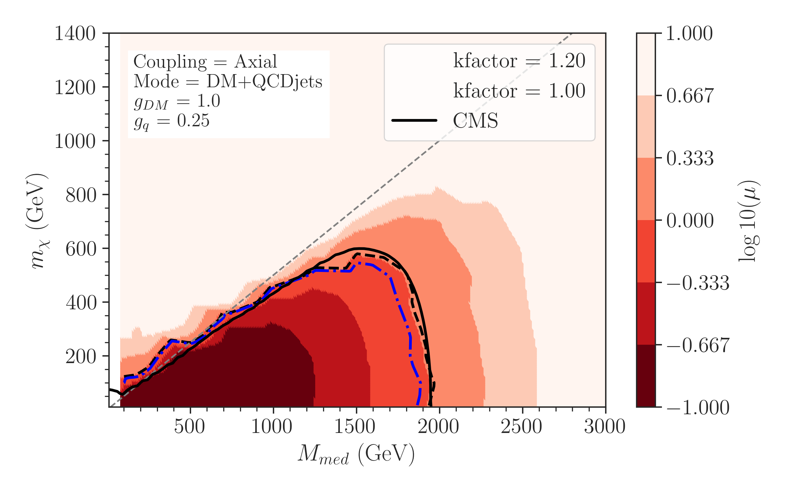

## Authors: ##
[Andre Lessa](mailto:andre.lessa@ufabc.edu.br)
[Camila Ramos](mailto:ramos.camila@ufabc.edu.br)

# MonoXSMS

Repository for storing the code and results for studies related to LHC Mono-X searches and simplified models (SMS). Here we present the results of the [CMS-EXO-20-004 analysis](http://cms-results.web.cern.ch/cms-results/public-results/publications/EXO-20-004/index.html) validation, specifically the dark matter (DM) production in SMS via new mediators with spin 1 and 0. We also provide details about event generation of events and event selection, which can be found [here](generation-and-selection.md).

## Results ##

The validation plots are generated through ipython notebooks for each coupling setting: [axial](../../notebooks/plotValidation-Axial.ipynb), [vector](../../notebooks/plotValidation-Vector.ipynb), [scalar](../../notebooks/plotValidation-Scalar.ipynb), and [pseudoscalar](../../notebooks/plotValidation-Pseudoscalar.ipynb). As shown in the figures below, a k-factor is needed in order to better reproduce the CMS analysis results.

    
    

    
    

Below we show the impacts on the events generated by the multiple cuts used in the event selection. We compare the values from the CMS analysis (CMS efficiency column) with our validation (Recast efficiency column) in the "Relative differece column".

### Axial ###

 * $m_{med}$ = 2 TeV, $m_{DM}$ = 1 GeV
 
  |	 			Cut			 	|	CMS eff.    |	 Recast eff.     |   Relative difference   |
  | :---------------------------------------------------------- | :---------------: | :---------------:  |   :-----------------:   |
  |			     Full Sample		        |	1.0	    |	     1.0         |	     0.0	   |
  |	 		  Trigger Emulation		        |     0.89878	    |      0.98429  	 |	   0.08688 	   |
  | 		       $p_{T}^{miss} > 250$ GeV		 	|     0.45603 	    |	   0.42478	 |	   0.07358	   |
  | 		   $p_{T}^{miss}$ quality filters		|     0.45504	    |     ---------      |	  ---------  	   |
  |     		  Electron veto 		        |     0.45407	    |	   0.42477	 |	   0.06898	   |
  |			    Muon veto			 	|     0.45283       |	   0.42473	 |	   0.06615	   |
  |     		    Tau veto				|     0.44311       |	   0.41499	 |	   0.06776	   |
  |     		   b jet veto				|     0.44311	    |	   0.36210	 |         0.22373	   |
  |       		  Photon veto				|     0.43913       |	   0.34949	 |	   0.25651	   |
  |  	  $\Delta \phi (p_{T}^{jet}, p_{T}^{miss}) > 0.5$ rad   |     0.40875       |	   0.34851	 |	   0.17286	   |
  |	$\Delta p_{T}^{miss} (\mathrm{PF}-\mathrm{Cal}) < 0.5$  |     0.40683 	    |	  ---------	 |	  ---------	   |
  |     	Leading AK4 jet  $p_{T} > 100$ GeV	 	|     0.39557       |	   0.34650	 |	   0.14161	   |
  |     	   Leading AK4 jet  $\eta < 2.4$		|     0.39557       |	   0.34650	 |	   0.14161	   |
  |     	Leading AK4 jet  energy fractions		|     0.39366	    |	  ---------	 |	  ---------	   |
  |     	    Mono-V overlap removal			|     0.378	    |	  ---------	 |	  ---------	   |
  |  	 	    HCAL mitigation (jets)	 		|     0.378         |	   0.34650	 |	   0.09091	   |
  |   	   	HCAL mitigation ($\phi^{miss}$)			|     0.378         |	   0.34650	 |	   0.09091	   |
  |   $\Delta \phi(\mathrm{PF}_{\mathrm{charged}}) < 2.0$ rad   |     0.37794       |	  ---------	 |	  ---------	   |
  
### Vector ###

  * $m_{med}$ = 2 TeV, $m_{DM}$ = 1 GeV

  |	 			Cut			 	|	CMS eff.    |	 Recast eff.     |   Relative difference   |
  | :---------------------------------------------------------- | :---------------: | :---------------:  |   :-----------------:   |
  |			     Full Sample		        |	1.0	    |	     1.0         |	     0.0	   |
  |	 		  Trigger Emulation		        |     0.89835	    |      0.98867  	 |	   0.09135 	   |
  | 		       $p_{T}^{miss} > 250$ GeV		 	|     0.45225 	    |	   0.43722	 |	   0.03438	   |
  | 		   $p_{T}^{miss}$ quality filters		|     0.45138	    |     ---------      |	  ---------  	   |
  |     		  Electron veto 		        |     0.45047	    |	   0.43722	 |	   0.03031	   |
  |			    Muon veto			 	|     0.44917       |	   0.43722	 |	   0.02733	   |
  |     		    Tau veto				|     0.43972       |	   0.42386	 |	   0.03742	   |
  |     		   b jet veto				|     0.43972	    |	   0.37369	 |         0.17669	   |
  |       		  Photon veto				|     0.43576       |	   0.36551	 |	   0.19219	   |
  |  	  $\Delta \phi (p_{T}^{jet}, p_{T}^{miss}) > 0.5$ rad   |     0.40619       |	   0.36439	 |	   0.11471	   |
  |	$\Delta p_{T}^{miss} (\mathrm{PF}-\mathrm{Cal}) < 0.5$  |     0.40451 	    |	  ---------	 |	  ---------	   |
  |     	Leading AK4 jet  $p_{T} > 100$ GeV	 	|     0.3934        |	   0.36275	 |	   0.08448	   |
  |     	   Leading AK4 jet  $\eta < 2.4$		|     0.3934        |	   0.36275	 |	   0.08448	   |
  |     	Leading AK4 jet  energy fractions		|     0.39145	    |	  ---------	 |	  ---------	   |
  |     	    Mono-V overlap removal			|     0.37622	    |	  ---------	 |	  ---------	   |
  |  	 	    HCAL mitigation (jets)	 		|     0.37622       |	   0.36275	 |	   0.03712	   |
  |   	   	HCAL mitigation ($\phi^{miss}$)			|     0.37622       |	   0.36275	 |	   0.03712	   |
  |   $\Delta \phi(\mathrm{PF}_{\mathrm{charged}}) < 2.0$ rad   |     0.37616       |	  ---------	 |	  ---------	   |
  
  
### Scalar ###

  * $m_{med}$ = 800 GeV, $m_{DM}$ = 1 GeV

  |	 			Cut			 	|	CMS eff.    |	 Recast eff.     |   Relative difference   |
  | :---------------------------------------------------------- | :---------------: | :---------------:  |   :-----------------:   |
  |			     Full Sample		        |	1.0	    |	     1.0         |	     0.0	   |
  |	 		  Trigger Emulation		        |     0.72050	    |      0.845405  	 |	   0.173358	   |
  | 		       $p_{T}^{miss} > 250$ GeV		 	|     0.35461 	    |	   0.353713	 |	   0.002531	   |
  | 		   $p_{T}^{miss}$ quality filters		|     0.35391	    |     ---------      |	  ---------  	   |
  |     		  Electron veto 		        |     0.35285	    |	   0.353713	 |	   0.002445	   |
  |			    Muon veto			 	|     0.35182       |	   0.353710	 |	   0.005371	   |
  |     		    Tau veto				|     0.34347       |	   0.344129	 |	   0.001920	   |
  |     		   b jet veto				|     0.34347	    |	   0.289479	 |         0.157192	   |
  |       		  Photon veto				|     0.34115       |	   0.287922	 |	   0.156024	   |
  |  	  $\Delta \phi (p_{T}^{jet}, p_{T}^{miss}) > 0.5$ rad   |     0.31455       |	   0.286411	 |	   0.089458	   |
  |	$\Delta p_{T}^{miss} (\mathrm{PF}-\mathrm{Cal}) < 0.5$  |     0.31319 	    |	  ---------	 |	  ---------	   |
  |     	Leading AK4 jet  $p_{T} > 100$ GeV	 	|     0.28847       |	   0.276335	 |	   0.042068	   |
  |     	   Leading AK4 jet  $\eta < 2.4$		|     0.28847       | 	   0.276335	 |	   0.042068	   |
  |     	Leading AK4 jet  energy fractions		|     0.28692	    |	  ---------	 |	  ---------	   |
  |     	    Mono-V overlap removal			|     0.27183	    |	  ---------	 |	  ---------	   |
  |  	 	    HCAL mitigation (jets)	 		|     0.27183       |	   0.276335	 |	   0.016571	   |
  |   	   	HCAL mitigation ($\phi^{miss}$)			|     0.27183       |	   0.276335	 |	   0.016571	   |
  |   $\Delta \phi(\mathrm{PF}_{\mathrm{charged}}) < 2.0$ rad   |     0.27175       |	  ---------	 |	  ---------	   |
  
  
### Pseudoscalar ###

  * $m_{med}$ = 800 GeV, $m_{DM}$ = 1 GeV

  |	 			Cut			 	|	CMS eff.    |	 Recast eff.     |   Relative difference   |
  | :---------------------------------------------------------- | :---------------: | :---------------:  |   :-----------------:   |
  |			     Full Sample		        |	1.0	    |	     1.0         |	     0.0	   |
  |	 		  Trigger Emulation		        |     0.72145	    |      0.824462  	 |	   0.142784	   |
  | 		       $p_{T}^{miss} > 250$ GeV		 	|     0.3572 	    |	   0.35851	 |	   0.003666	   |
  | 		   $p_{T}^{miss}$ quality filters		|     0.35652	    |     ---------      |	  ---------  	   |
  |     		  Electron veto 		        |     0.35551	    |	   0.358314	 |	   0.007888	   |
  |			    Muon veto			 	|     0.35442       |	   0.358309	 |	   0.010972	   |
  |     		    Tau veto				|     0.34581       |	   0.348715	 |	   0.008401	   |
  |     		   b jet veto				|     0.34581	    |	   0.296934	 |         0.141339	   |
  |       		  Photon veto				|     0.34353       |	   0.295317	 |	   0.140347	   |
  |  	  $\Delta \phi (p_{T}^{jet}, p_{T}^{miss}) > 0.5$ rad   |     0.31664       |	   0.292872	 |	   0.075062	   |
  |	$\Delta p_{T}^{miss} (\mathrm{PF}-\mathrm{Cal}) < 0.5$  |     0.31532 	    |	  ---------	 |	  ---------	   |
  |     	Leading AK4 jet  $p_{T} > 100$ GeV	 	|     0.29036       |	   0.286149	 |	   0.014503	   |
  |     	   Leading AK4 jet  $\eta < 2.4$		|     0.29036       | 	   0.286149	 |	   0.014503	   |
  |     	Leading AK4 jet  energy fractions		|     0.28853	    |	  ---------	 |	  ---------	   |
  |     	    Mono-V overlap removal			|     0.27322	    |	  ---------	 |	  ---------	   |
  |  	 	    HCAL mitigation (jets)	 		|     0.27322       |	   0.286149	 |	   0.047321	   |
  |   	   	HCAL mitigation ($\phi^{miss}$)			|     0.27322       |	   0.286149	 |	   0.047321	   |
  |   $\Delta \phi(\mathrm{PF}_{\mathrm{charged}}) < 2.0$ rad   |     0.27313       |	  ---------	 |	  ---------	   |
  
  
  
  
  
  
  
