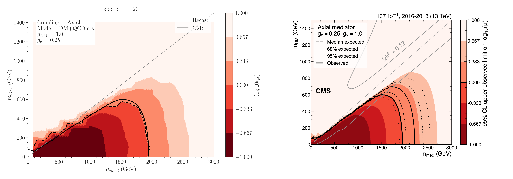

## Authors: ##
[Andre Lessa](mailto:andre.lessa@ufabc.edu.br)
[Camila Ramos](mailto:ramos.camila@aluno.ufabc.edu.br)

# MonoXSMS

Repository for storing the code and results for studies related to LHC Mono-X searches and simplified models (SMS).

## Event Generation ##

In both models, the events are generated at leading order (LO) using MadGraph_aMC@NLO version 3.4.2, with PYTHIA and Delphes versions integrated in MadGraph, and with the DMSIMP model implemented. The entire setup can be installed through this [script](../../installer.sh). While the CMS-EXO-20-004 analysis include a combination of the Mono-V and MonoJet signal regions (SRs), the results obtained here only cover the MonoJet SRs.

The dark matter (DM) pairs are produced firstly with no additional parton, and secondly with one parton. During the generation a bias module is used on the jet transverse momentum ($p_{T}$) in order to smoothen the event distributions. Additionally, we use the MLM matching scheme to combine jets from matrix element calculatrions with the parton shower. Then, the events are combined. We perform the generations separately since the bias module cannot be implemented with the MLM matching scheme otherwise.

For the showering process we vary the cutoff scale "xqcut", using the mediator mass as reference. The xqcut value is set as $m_{med}/15$, unless $m_{med}$ is too light, and in that case we choose xqcut = $30$. 

Other relevant information about the model, event generation or showering, hadronization processes can be found in the [Cards](../../Cards/) folder.

## Event Selection ##

After generating the events, we randomly split them into three datasets, representing the 2016, 2017, and 2018 for comparison with the background and observed samples given by the CMS analysis. (failure mitigation hcal 2018).In order to reproduce the CMS event selection, the following cuts were implemented after the event generation:

| Variable 	  | 		Selection		|
| :------------- | :---------------------------------: |
|AK4 jets	| $p_{T} > 20$ GeV,  $\|\eta\| < 2.4$  |
|AK4 leading jet| $p_{T} < 100$ GeV, $\|\eta\| < 2.4$ |
|tau-tagged jets| $p_{T} > 18$ GeV, $\|\eta\| < 2.3$  |
|b-tagged jets	| $p_{T} > 20$ GeV, $\|\eta\| < 2.4$  |
|missing energy | $p_{T}^{miss} > 250$ GeV	    |
| electron veto | $p_{T} > 10$ GeV, $\|\eta\| < 2.5$  |
| muon veto     | $p_{T} > 10$ GeV, $\|\eta\| < 2.4$  |
| photon veto   | $p_{T} > 15$ GeV, $\|\eta\| < 2.5$  |

## Results ##

The following validation plots can be generated running this [ipython notebook](../../notebooks/plotValidation-Axial.ipynb):

 * mLLP = 2 TeV, mDM = 1 GeV, Coupling = Axial
 
  | 			Cut			 |  CMS eff.  |   Recast eff.   |   Relative difference   |
  | :------------------------------------------- | :--------: | :------------:  |   :-----------------:   |
  |		     Full Sample	         |     1.0    |       1.0       |	    0.0		  |
  | 		Trigger Emulation	         |   0.89878  |     0.98429	|	 0.08688 	  |
  | 	$p_{T}^{miss} > 250$ GeV		 |   0.45603  |	    0.42478	|	 0.07358	  |
  | 	$p_{T}^{miss}$ quality filters		 |   0.45504  |     -------     |	 -------	  |
  |     	Electron veto 		         |   0.45407  |	    0.42477	|	 0.06898	  |
  |		Muon veto			 |   0.45283  |	    0.42473	|	 0.06615	  |
  |     	Tau veto			 |   0.44311  |	    0.41499	|	 0.06776	  |
  |     	b jet veto			 |   0.44311  |	    0.36210	|        0.22373	  |
  |       	Photon veto			 |   0.43913  |	    0.34949	|	 0.25651	  |
  |  $\Delta \phi (jet, p_{T}^{miss}) > 0.5$ rad |   0.40875  |	    0.34851	|	 0.17286	  |
  |  $\Delta p_{T}^{miss} (PF-Cal) < 0.5$ rad	 |   0.40683  |	    -------	|	 -------	  |
  |     Leading AK4 jet  $p_{T} > 100$ GeV	 |   0.39557  |	    0.34650	|	 0.14161	  |
  |     Leading AK4 jet  $\eta < 2.4$		 |   0.39557  |	    0.34650	|	 0.14161	  |
  |     Leading AK4 jet  energy fractions	 |   0.39366  |	    -------	|	 -------	  |
  |     	Mono-V overlap removal		 |   0.378    |	    -------	|	 -------	  |
  |  	 HCAL mitigation (jets)			 |   0.378    |	    0.34650	|	 0.09091	  |
  |   	 HCAL mitigation ($\phi^{miss}$)	 |   0.378    |	    0.34650	|	 0.09091	  |
  |   $\Delta \phi$(PF$_{charged}$) $< 2.0$ rad  |   0.37794  |	    -------	|	 -------	  |
  
  * mLLP = 2 TeV, mDM = 1 GeV, Coupling = Vector
 
  | 			Cut			 |  CMS eff.  |   Recast eff.   |   Relative difference   |
  | :------------------------------------------- | :--------: | :------------:  |   :-----------------:   |
  |		     Full Sample	         |     1.0    |       1.0       |	    0.0		  |
  | 		Trigger Emulation	         |   0.89835  |     0.98867	|	 0.09135	  |
  | 	$p_{T}^{miss} > 250$ GeV		 |   0.45225  |	    0.43722	|	 0.03438	  |
  | 	$p_{T}^{miss}$ quality filters		 |   0.45138  |     -------     |	 -------	  |
  |     	Electron veto 		         |   0.45047  |	    0.43722	|	 0.03031	  |
  |		Muon veto			 |   0.44917  |	    0.43722	|	 0.02733	  | 
  |     	Tau veto			 |   0.43972  |	    0.42386	|	 0.03742	  |
  |     	b jet veto			 |   0.43972  |	    0.37369	|        0.17669	  |
  |       	Photon veto			 |   0.43576  |	    0.36551	|	 0.19219	  |
  |  $\Delta \phi (jet, p_{T}^{miss}) > 0.5$ rad |   0.40619  |	    0.36439	|	 0.11471	  |
  |  $\Delta p_{T}^{miss} (PF-Cal) < 0.5$ rad	 |   0.40451  |	    -------	|	 -------	  |
  |     Leading AK4 jet  $p_{T} > 100$ GeV	 |   0.3934   |	    0.36275	|	 0.08448	  |
  |     Leading AK4 jet  $\eta < 2.4$		 |   0.3934   |	    0.36275	|	 0.08448	  |
  |     Leading AK4 jet  energy fractions	 |   0.39145  |	    -------	|	 -------	  |
  |     	Mono-V overlap removal		 |   0.37622  |	    -------	|	 -------	  |
  |  	 HCAL mitigation (jets)			 |   0.37622  |	    0.36275	|	 0.03712	  |
  |   	 HCAL mitigation ($\phi^{miss}$)	 |   0.37622  |	    0.36275	|	 0.03712	  |
  |   $\Delta \phi$(PF$_{charged}$) $< 2.0$ rad  |   0.37616  |	    -------	|	 -------	  |
  
  
  
  
  
  
  
